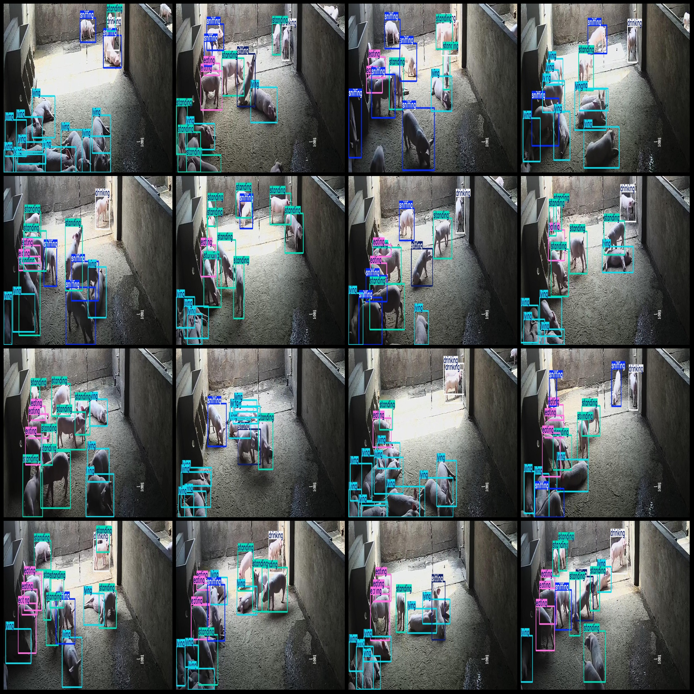
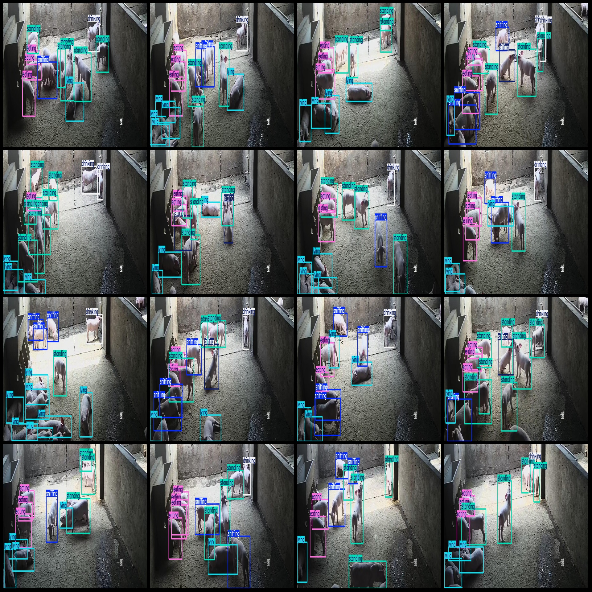

# Wisdom Breeding Pig Behavior State, Drinking, Eating, Lying, Sitting, Sniffing, Standing Dataset (VOC+YOLO Format) - 2628 Images (6 Classes)

Dataset Format: Pascal VOC format + YOLO format (txt file without split path, only containing jpg images and corresponding VOC format xml files and YOLO format txt files).
Number of Images (jpg files): 2628
Number of Annotations (xml files): 2628
Number of Annotations (txt files): 2628
Number of Annotation Categories: 6
Annotation Category Names (Note that the order in the YOLO format is not consistent with this, and should be based on the labels folder classes.txt): ["drinking", "eating", "lying", "sitting", "sniffing", "standing"]
Number of Boxes per Category:
Drinking (Drinking) Boxes = 2326
Eating (Eating) Boxes = 5372
Lying (Lying) Boxes = 10579
Sitting (Sitting) Boxes = 854
Sniffing (Sniffing) Boxes = 4439
Standing (Standing) Boxes = 8072
Total Boxes: 31642
Image Resolution: 1450x580
Annotation Tool Used: labelImg
Annotation Rules: Draw a box around the category
Important Notice: The dataset does not have a division into training, validation, or test sets; you need to divide it yourself.
Special Disclaimer: This dataset does not guarantee any accuracy in the models trained or weights files.
Image Preview:

## Images

Here is a pay link on Stripe ( https://buy.stripe.com/3cs8yP7sY87d0vu9AB ). Please contact me lonlonago@foxmail.com after funding $89, and I will send you a complete data files , thank you!

